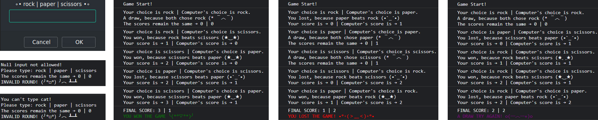

# The Odin Project Web Development 101

## Project: Rock Paper Scissors

Simple implementation of Rock Paper Scissors game from The Odin Project [curriculum](https://www.theodinproject.com/paths/foundations/courses/foundations/lessons/rock-paper-scissors).

This is a **HTML/CSS/JS** project. **Live version** of the game is [here](https://Ha-Mundo.github.io/rock-paper-scissors-game/).

### First stage | Game in the browser console

**The benefits I got from this stage:**

- Deepened knowledge of how **functions work** with each other.
- Learned how to color the **console text**.
- Enjoyed stylizing the **prompt** and **console texts**.

